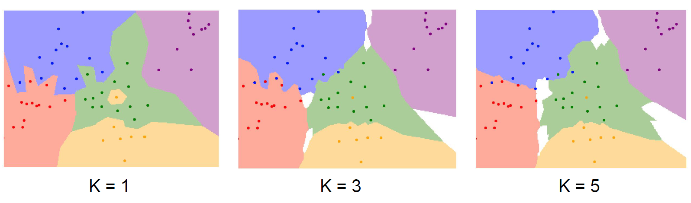
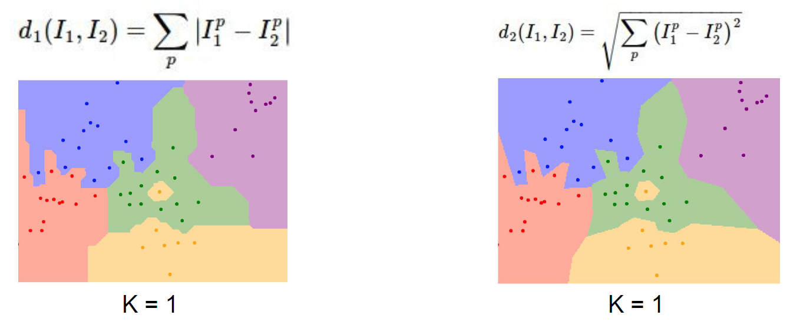
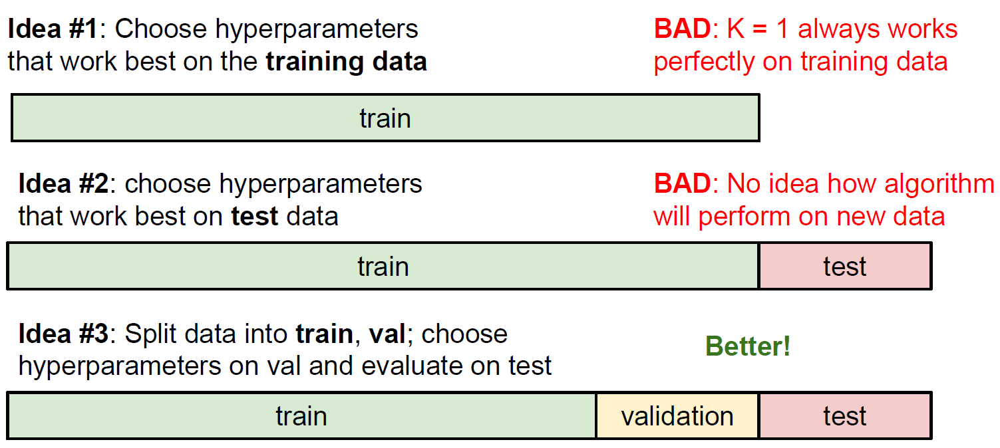
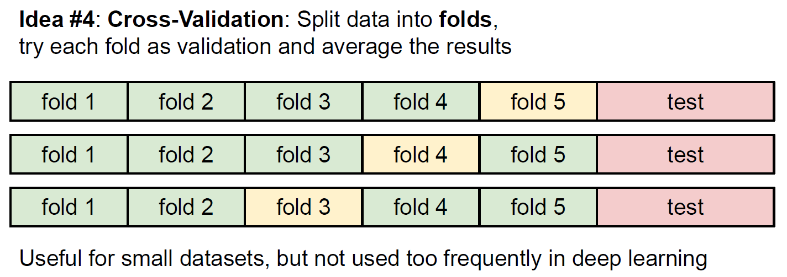
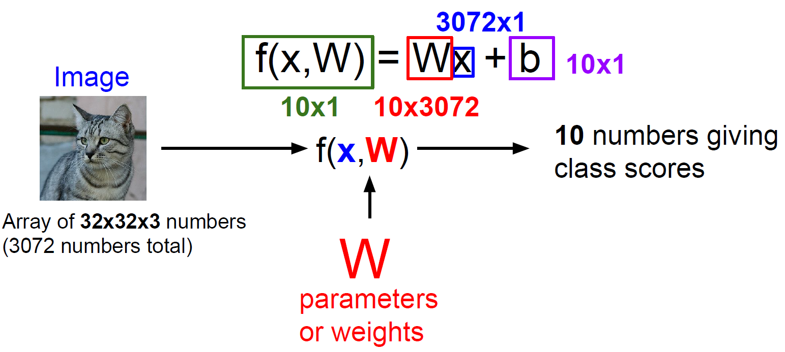
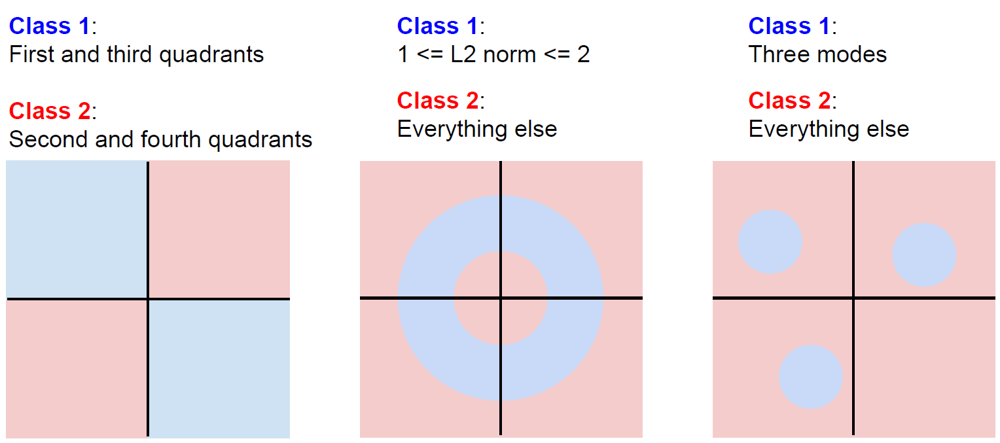

<script type="text/x-mathjax-config">   MathJax.Hub.Config({     tex2jax: {       inlineMath: [ ['$','$'], ["\\(","\\)"] ],       processEscapes: true     }   }); </script>

<script src="https://cdn.mathjax.org/mathjax/latest/MathJax.js?config=TeX-AMS-MML_HTMLorMML" type="text/javascript"></script>

# 2 Image Classification
## Challenge
* Viewpoint Variation 视角的变化
* Background Clutter 背景的影响
* Illumination
* Occlusion
* Deformation
* Intraclass Variation

## 设计一个图像分类器
``` python
def classify_image(image):
    # code
    return class_label
```
**Data-Driven的方法：机器学习**
``` python
def train(images, labels):
    # Machine Learning
    return model

def predict(model, test_images):
    # Use model to predict labels
    return test_labels
```
步骤如下：
1. 收集一个有标签的图片数据集
2. 用机器学习的方法训练一个分类器
3. 在新的图片上评估分类器


## Nearest Neighbor Classifier
train: 记住所有数据和标签

predict： 找到训练集中最相似的图片，就是预测的标签

相似的衡量标准： 

L1距离（Manhattan Distance）： $d_1(I_1,I_2)=\sum_p|I^p_1-I^p_2|$

也就是对两张图片每个像素点的差求和

特点：训练很快（仅仅只是保存数据），预测很慢每个预测都要循环N次

## K-Nearest Neighbors
和NN的区别是选最接近的K个label，做一个投票，来决定属于哪一类

用图片表示
<div align=center>

</div>
相似的衡量尺度使用： 

L2距离（Euclidean Distance）：$d_2(I_1,I_2)=\sqrt{\sum_p(I^p_1-I^p_2)^2}$

和L1的区别：
<div align=center>

</div>

**超参数（Hyperparameters）**
算法本身需要选择的参数：

例如K的值，以及距离算法的选择

超参数的选择是依赖于问题以及数据集的，只能都尝试之后选择表现最好的

**选择超参数的方法**
<div align=center>

</div>

应该将数据集划分为三个：训练集、验证集、测试集
* 训练集：用来训练分类器
* 验证集：训练好来评估超参数的好坏，然后调整
* 测试集：最后最后，分类器完全训练好之后，用来评估分类器的性能

当数据集比较小的时候，可以使用交叉验证的方法：
<div align=center>

</div>

也就是测试集不动，其余分为若干个fold，每次选择不同的某个fold来作为验证集，从而增加多样性。因此在深度学习中很少使用

实践中几乎不会使用

因为有以下缺陷：
1. 用像素距离作为衡量相似的标准，提供不了有效的信息，效果并不好
2. 测试时速度非常慢（每次都要循环遍历）
3. 随着维度增加，点的数量指数型增长

## Linear Classification
### Parametric Approach
用训练集训练得到一个函数$f(x, W)=Wx$

将训练集的信息存到函数的参数$W$中，然后需要预测的图片送入函数，得到针对每个class的预测分数

并且通常会增加一个独立于数据集的bias项，表示为：
$$
f(x, W)=Wx+b
$$

<div align=center>

</div>

此外，Linear Classification的缺陷在于，存在线性不可分的情况

<div align=center>

</div>