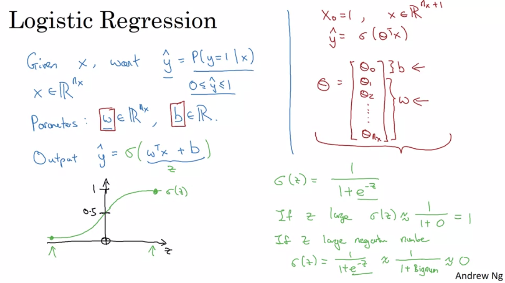
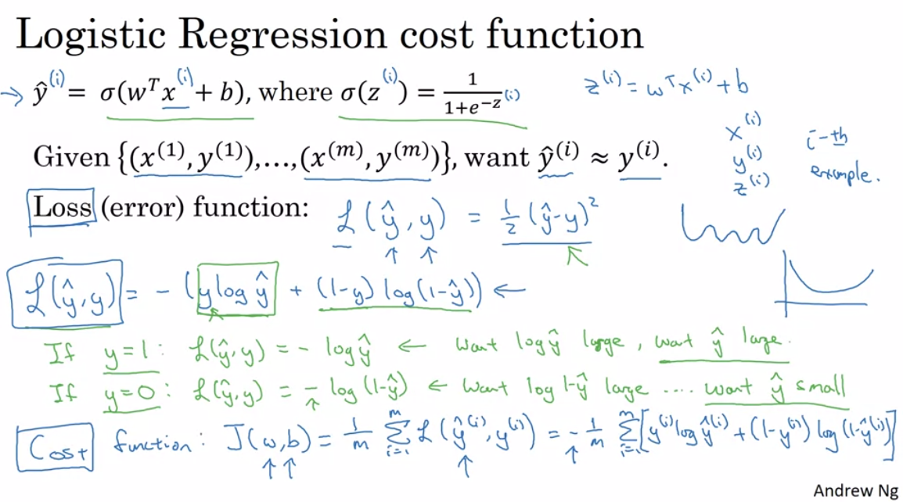
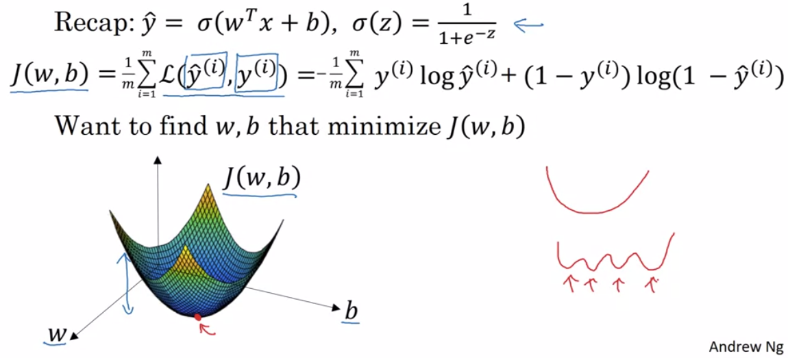
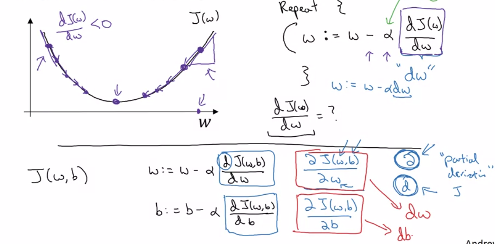
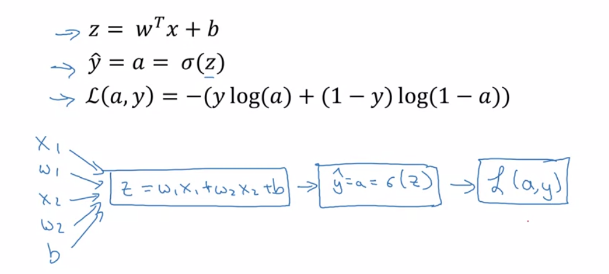
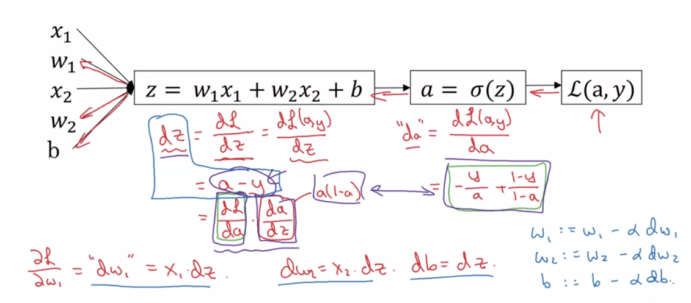
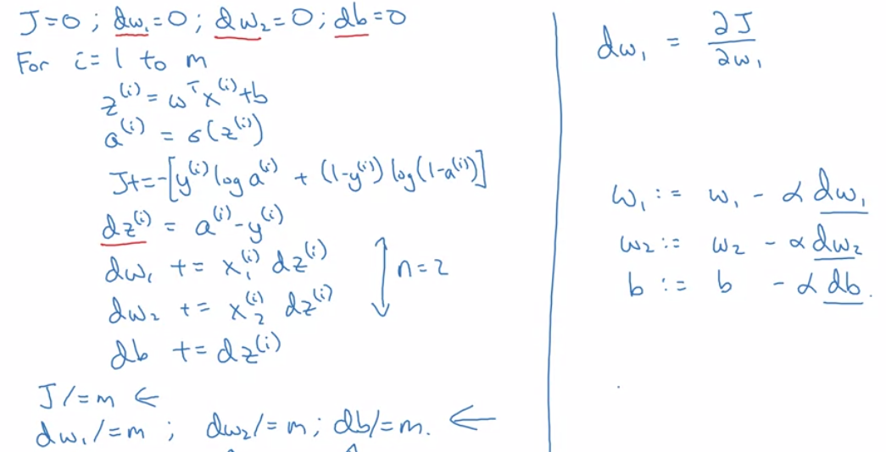

# 2 Basics of Neural Network programming

## Logistic Regression

给定输入 $\vec{x}\in\mathbb{R}^{n_x}$，想要预测得到$\hat{y}=P(y=1|\vec{x})$

两个参数 $w\in\mathbb{R}^{n_x}, b\in\mathbb{R}$

由于要使得$\hat{y}\in[0,1]$，所以加上一个sigmoid函数$\sigma(z)=\frac{1}{1+e^{-z}}$

所以输出
$$
\hat{y}=\sigma(w^Tx+b)
$$

## Logistic Regression Cost Function

Loss function是单个的

Cost function是加起来求和

这里的Cost Function是凸函数

## Gradient Descent

$$
w := w-\alpha\frac{\partial J(w,b)}{\partial w} \\
b := w-\alpha\frac{\partial J(w,b)}{\partial b}
$$

## Computing Derivatives with a Computational Graph

反向传播 —> 链式法则

编程时用`dvar`指代$\frac{\partial{J}}{\partial{var}}$

## Logistic Regression Gradient Descent

$$
da=\frac{\partial{J}}{\partial{a}}=-\frac{y}{a}+\frac{1-y}{1-a} \\
\frac{\partial{a}}{\partial{z}}=\frac{e^{-z}}{(1+e^{-z})^2}=a(1-a) \\
dz=\frac{\partial{J}}{\partial{z}}
=\frac{\partial{J}}{\partial{a}}\frac{\partial{a}}{\partial{z}}
=(-\frac{y}{a}+\frac{1-y}{1-a})*a(1-a)=a-y \\
$$
所以
$$
z=w_1x_1+w_2x_2+b \\
dw_1=x_1dz=x_1(a-y) \\
dw_2=x_2dz=x_2(a-y) \\
db=dz=a-y
$$
当有 m 个Examples时

m个Examples时，每次计算就是对每个样本$x^i$求得得$dw$求和，最后取平均算出最终的$dw$，然后开始迭代$w$

这样的缺陷是，会进行两层循环，$m * n$ 次
