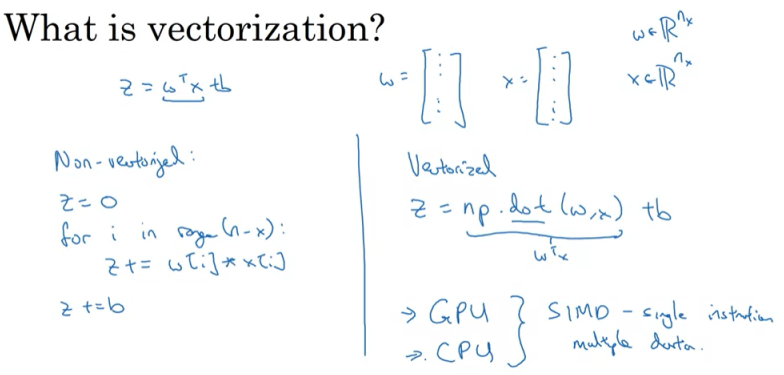
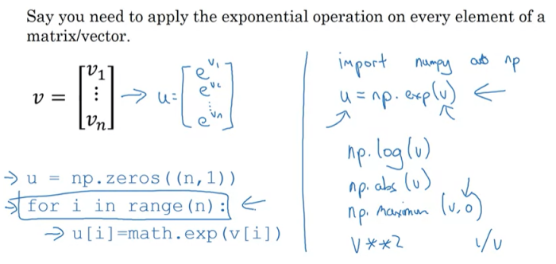
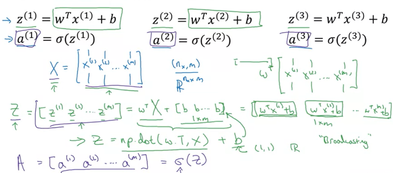
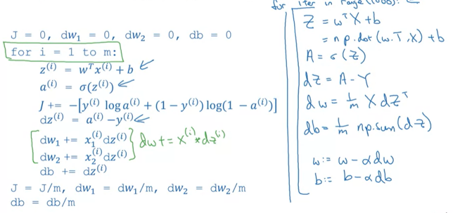

<script type="text/x-mathjax-config">   MathJax.Hub.Config({     tex2jax: {       inlineMath: [ ['$','$'], ["\\(","\\)"] ],       processEscapes: true     }   }); </script>

<script src="https://cdn.mathjax.org/mathjax/latest/MathJax.js?config=TeX-AMS-MML_HTMLorMML" type="text/javascript"></script>

# Week 2 Basics of Neural Network programming

## 2.1 Logistic Regression as a Neural Network

### 2.1.1 Logistic Regression

<div align=center>

</div>

给定输入 $\vec{x}\in\mathbb{R}^{n_x}$，想要预测得到 $\hat{y}=P(y=1|\vec{x})$

用两个参数 $w\in\mathbb{R}^{n_x}, b\in\mathbb{R}$，来计算 $\hat{y}$

由于要使得 $\hat{y}\in[0,1]$，所以加上一个sigmoid函数$\sigma(z)=\frac{1}{1+e^{-z}}$

所以输出
$$
\hat{y}=\sigma(w^Tx+b)
$$


### 2.1.2 Logistic Regression Cost Function
<div align=center>

</div>

对于一次预测 $\hat{y}$ ，使用损失函数Loss Function衡量其准确性

例如 $L(\hat{y},y)=\frac{1}{2}(\hat{y}-y)^2$，但它是非凸函数，难以求得全局最小值，所以Loss Function使用：

$$
L(\hat{y},y)=-(ylog\hat{y}+(1-y)log(1-\hat{y}))
$$

Loss Function是针对单个的输入预测得到的 $\hat{y}$ 计算，当有 $m$ 个样本时，将每个样本的Loss Function值求和就是Cost Function

$$
J(w,b)=\frac{1}{m}\sum^m_{i=1}L(\hat{y}^i,y^i)
$$


### 2.1.3 Gradient Descent
<div align=center>

</div>
<div align=center>

</div>

有了Cost Function之后，我们的目的就是让它最小，因此用到的方法就是梯度下降，让两个参数 $w$ 和 $b$，从初始化的位置，沿着梯度方向迭代，即：

$$
w := w-\alpha\frac{\partial J(w,b)}{\partial w} \\
b := w-\alpha\frac{\partial J(w,b)}{\partial b}
$$

### 2.1.4 Computing Derivatives with a Computational Graph
因此，现在要解决的问题就是如何计算梯度，用到的方法是反向传播。

反向传播 —> 链式法则

编程时用`dvar`指代 $\frac{\partial{J}}{\partial{var}}$


### 2.1.5 Logistic Regression Gradient Descent
<div align=center>

</div>
<div align=center>

</div>

把Logistic Regression的Loss Function带入到梯度下降计算公式中，来计算每一步的微分：

$$
da=\frac{\partial{J}}{\partial{a}}=-\frac{y}{a}+\frac{1-y}{1-a} \\
\frac{\partial{a}}{\partial{z}}=\frac{e^{-z}}{(1+e^{-z})^2}=a(1-a) \\
dz=\frac{\partial{J}}{\partial{z}}
=\frac{\partial{J}}{\partial{a}}\frac{\partial{a}}{\partial{z}}
=(-\frac{y}{a}+\frac{1-y}{1-a})*a(1-a)=a-y \\
$$

所以

$$
z=w_1x_1+w_2x_2+b \\
dw_1=x_1dz=x_1(a-y) \\
dw_2=x_2dz=x_2(a-y) \\
db=dz=a-y
$$

当有 $m$ 个Examples时，根据Cost Function的定义，我们要对这 $m$ 个Examples的Loss Function求和，也就是Cost Funtion的各参数微分实际上是每个Example的各参数微分值求和得到
<div align=center>

</div>
<div align=center>

</div>

每次计算流程就是：

对每个样本 $x^i$，求出各个参数的微分，包括 $dw_1^i, dw_2^i, ..., db^i$ ，然后所有样本的参数微分求和，最后取平均，算出最终的 $dw_1, dw_2, ..., db$ ，然后开始梯度下降迭代 $w$ 和 $b$

这样显式循环的做法，会进行两层循环，$m * n$ 次

## 2.2 Python and Vectorization
前面提到的两层显式循环运算速度很慢，使用Python的Vectorization方法，可以有效地提升速度

### 2.2.1 Vectorization
<div align=center>

</div>

Vectorization，也就是向量化，实际上是并行计算向量的运算，来避免对向量各个元素的遍历。这是一种SIMD-single instruction multiple data的操作，CPU和GPU上都可以实现，对多组数据，并行同时运算，显著提升速度

具体代码实现上，用到的是Python的Numpy实现，其可以方便地对向量进行运算，例如乘法：`np.dot(a,b)`，指数运算：`u=np.exp(v)`

<div align=center>

</div>


### 2.2.2 Vectorizing Logistic Regression

<div align=center>

</div>

将这种向量化方法应用到Logistic Regression中

对于外层的 $m$ 个Examples循环计算Logistic Regression，可以合并为一个矩阵，每个 $x^i$ 合并成大小为 $n_x * m$ 的矩阵 $\matrix{X}$ ，$\matrix{z}$ 计算如下：
$$
Z=w^T\matrix{X}+\vec{b}
$$
这里的 $\vec{b}$ 是 $1 * m$ 的 $b$ 的组合

实现的伪代码如下：

``` python 
Z = np.dot(w.T,X) + b
A = sigmoid(Z)
```

`b`是一个实数，但与matrix相加，可以进行broadcasting


### 2.2.3 Vectorizing Logistic Regression's Gradient Output

<div align=center>

</div>
外层的 $m$ 个Examples向量化之后，实际上对于梯度下降时各参数计算的微分也可以向量化

样本 $x$ 有 $n_x$ 个分量，因此可以将 $dw_1,dw_2,...,dw_n$ 合并为 $dw$，而一步计算，实现的伪代码如下：

``` python
Z = np.dot(w.T,X) + b
A = sigmoid(Z)
dZ = A - Y
dw = 1/m * np.dot(X, dZ)
db = 1/m * np.sum(dZ)
w = w - alpha * dw
b = b - alpha * db
```

对于最外层的梯度下降迭代的循环，不能使用向量化了，只能显式地循环迭代