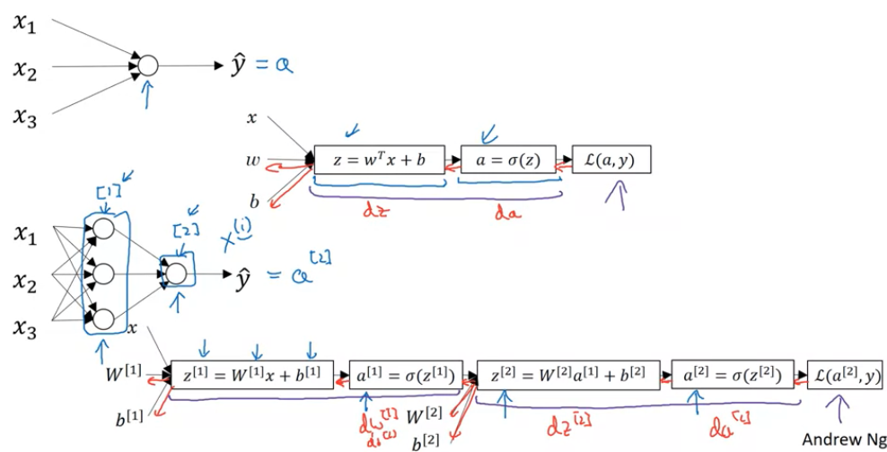
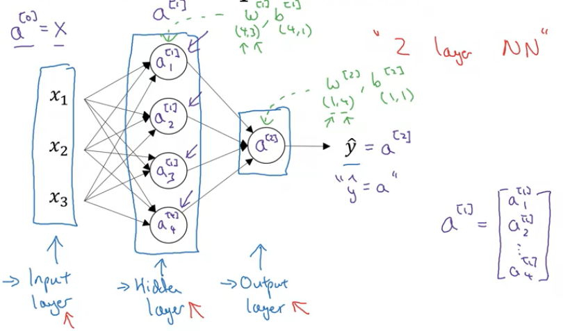
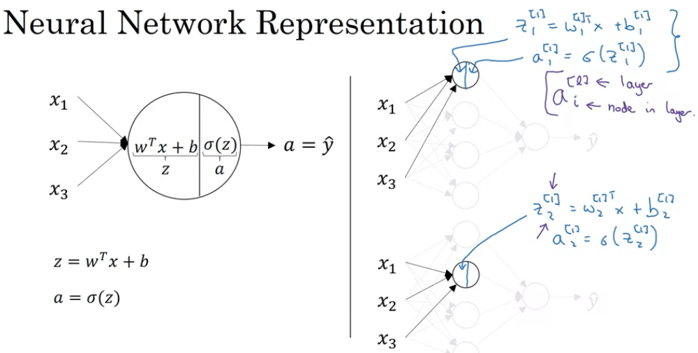
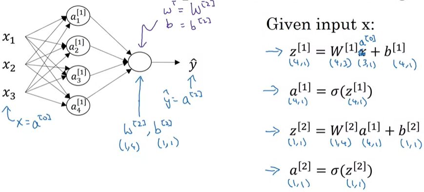
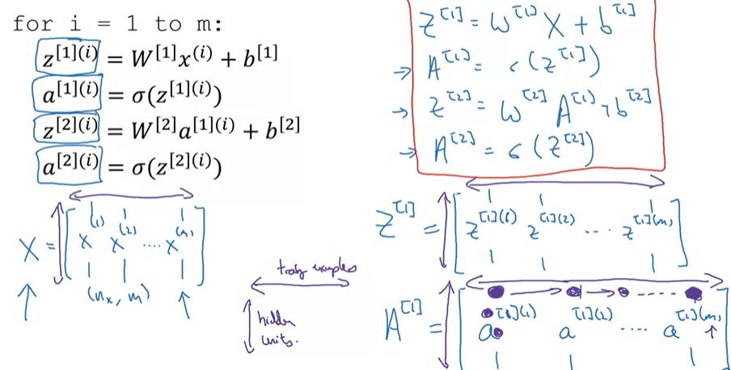

# Week 3 Shallow Neural Network
## 3.1 Neural Networks Overview

神经网络是许多个Logistic Regression组合起来的，每个神经元就代表一个Logistic Regression计算。

简单的Logistic Regression只进行一次正向计算，而神经网络会进行多层的计算，并且每层有多个神经元的计算，最后计算出Lost Function，从这个Lost Function出发，反向传播算出每层的微分

## 3.2 Neural Network Representation

如上图是一个简单的神经网络结构，包括：
* 输入层：样本特征输入 $x$
* 隐含层：计算并不显式表达出来的计算层
* 输出层：输出样本预测值 $\hat{y}$

中括号上标代表是第几层的参数，下标是在一层中的第几个参数

## 3.3 Computing a Neural Network's Output

在第一层，每个神经元分别对输入特征计算

第一层的第一个：

$$
z_1^{[1]}=w_1^{[1]T}x+b_1^{[1]} \\
a_1^{[1]}=\sigma(z_1^{[1]})
$$

第一层的第二个：

$$
z_2^{[1]}=w_2^{[1]T}x+b_2^{[1]} \\
a_2^{[1]}=\sigma(z_2^{[1]})
$$

$w_1^{[1]T}-(1,3),x-(3,1),b_1^{[1]}-(1,1)$
$z_1^{[1]} = w_1^{[1]T}x+b_1^{[1]}-(1,1)$

将 $w_1^{[1]T},w_2^{[2]T},w_3^{[3]T},w_4^{[4]T}$ 纵向堆叠成 $W^{[1]}-(4,3)$ ， $b_1^{[1]},b_2^{[2]},b_3^{[3]},b_4^{[4]}$ 纵向堆叠成 $b^{[1]}-(4,1)$ ，所以计算：

$$
z^{[1]}=W^{[1]}x+b^{[1]} \\
a^{[1]}=\sigma({z^{[1]}})
$$

$W^{[1]}-(4,3),x-(3,1),b^{[1]}-(4,1)$
$z^{[1]}=W^{[1]}x+b^{[1]}-(4,1), a^{[1]}-(4,1)$

$x$ 可以写成 $a^{[0]}$ ，即：

$$
z^{[1]}=W^{[1]}a^{[0]}+b^{[1]} \\
a^{[1]}=\sigma({z^{[1]}})
$$

计算完第一层之后，计算第二层：

$$
z^{[2]}=W^{[2]}a^{[1]}+b^{[2]} \\
a^{[2]}=\sigma({z^{[2]}})
$$

其中，$W^{[2]}=w^{T},b^{[2]}=b$

$W^{[2]}-(1,4),a^{[1]}-(4,1),b^{[2]}-(1,1)$
$z^{[2]}=W^{[2]}a^{[1]}+b^{[2]}-(1,1), a^{[2]}-(1,1)$

## 3.4 Vectorizing Across Multiple Examples

前面提到的，是针对单个样本的计算，当有 $m$ 个样本时，需要循环遍历：

`for i = 1 to m:`
$$
z^{[1](i)}=W^{[1]}x^{(i)}+b^{[1]} \\
a^{[1](i)}=\sigma({z^{[1](i)}}) \\
z^{[2](i)}=W^{[2]}a^{[1](i)}+b^{[2]} \\
a^{[2](i)}=\sigma({z^{[2](i)}})
$$

将 $x^{(1)},x^{(2)},...,x^{(m)}$ 横向堆叠成 $X-(n_x,m)=(3,m)$ ，将$z^{[1](1)},z^{[1](2)},...,z^{[1](m)}$ 横向堆叠成 $Z^{[1]}-(4,m),A^{[1]}-(4,m),Z^{[2]}-(1,m),A^{[2]}-(1,m)$ 同理

所以，经过Vectorization，计算变为：

$$
Z^{[1]}=W^{[1]}X+b^{[1]} \\
A^{[1]}=\sigma(Z^{[1]}) \\
Z^{[2]}=W^{[2]}A^{[1]}+b^{[2]} \\
A^{[2]}=\sigma(Z^{[2]})
$$

$W^{[1]}-(n_{l_1},n_x),X-(n_x,m),b^{[1]}-(n_{l_1},1)$
$Z^{[1]}=W^{[1]}X+b^{[1]}-(n_{l_1},m),A^{[1]}-(n_{l_1},m)$
$W^{[2]}-(n_{l_2},n_x),X-(n_x,m),b^{[2]}-(n_{l_2},1)$
$Z^{[2]}=W^{[2]}X+b^{[2]}-(n_{l_2},m),A^{[2]}-(n_{l_2},m)$

对于 $A^{[i]}$ ，横向是训练样本的数量，纵向是该层神经元的数量