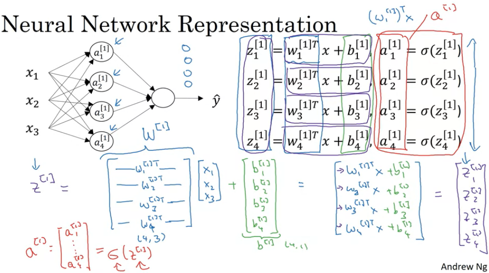
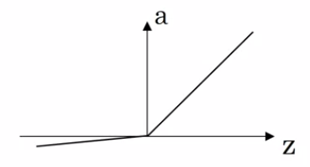

# Week 3 Shallow Neural Network
## 3.1 Neural Networks Overview

神经网络是许多个Logistic Regression组合起来的，每个神经元就代表一个Logistic Regression计算。

简单的Logistic Regression只进行一次正向计算，而神经网络会进行多层的计算，并且每层有多个神经元的计算，最后计算出Lost Function，从这个Lost Function出发，反向传播算出每层的微分

## 3.2 Neural Network Representation

如上图是一个简单的神经网络结构，包括：
* 输入层：样本特征输入 $x$
* 隐含层：计算并不显式表达出来的计算层
* 输出层：输出样本预测值 $\hat{y}$

中括号上标代表是第几层的参数，下标是在一层中的第几个参数

## 3.3 Computing a Neural Network's Output

在第一层，每个神经元分别对输入特征计算

第一层的第一个：

$$
\begin{aligned}
z_1^{[1]}&=w_1^{[1]T}x+b_1^{[1]} \\
a_1^{[1]}&=\sigma(z_1^{[1]})
\end{aligned}
$$

第一层的第二个：

$$
\begin{aligned}
z_2^{[1]}&=w_2^{[1]T}x+b_2^{[1]} \\
a_2^{[1]}&=\sigma(z_2^{[1]})
\end{aligned}
$$

$w_1^{[1]T}-(1,3),x-(3,1),b_1^{[1]}-(1,1)$
$z_1^{[1]} = w_1^{[1]T}x+b_1^{[1]}-(1,1)$

将 $w_1^{[1]T},w_2^{[2]T},w_3^{[3]T},w_4^{[4]T}$ 纵向堆叠成 $W^{[1]}-(4,3)$ ， $b_1^{[1]},b_2^{[2]},b_3^{[3]},b_4^{[4]}$ 纵向堆叠成 $b^{[1]}-(4,1)$ ，所以计算：

$$
\begin{aligned}
z^{[1]}&=W^{[1]}x+b^{[1]} \\
a^{[1]}&=\sigma({z^{[1]}})
\end{aligned}
$$

$W^{[1]}-(4,3),x-(3,1),b^{[1]}-(4,1)$
$z^{[1]}=W^{[1]}x+b^{[1]}-(4,1), a^{[1]}-(4,1)$

$x$ 可以写成 $a^{[0]}$ ，即：

$$
\begin{aligned}
z^{[1]}&=W^{[1]}a^{[0]}+b^{[1]} \\
a^{[1]}&=\sigma({z^{[1]}})
\end{aligned}
$$

计算完第一层之后，计算第二层：

$$
\begin{aligned}
z^{[2]}&=W^{[2]}a^{[1]}+b^{[2]} \\
a^{[2]}&=\sigma({z^{[2]}})
\end{aligned}
$$

其中，$W^{[2]}=w^{T},b^{[2]}=b$

$W^{[2]}-(1,4),a^{[1]}-(4,1),b^{[2]}-(1,1)$
$z^{[2]}=W^{[2]}a^{[1]}+b^{[2]}-(1,1), a^{[2]}-(1,1)$

## 3.4 Vectorizing Across Multiple Examples

前面提到的，是针对单个样本的计算，当有 $m$ 个样本时，需要循环遍历：

$$
\begin{aligned}
\text{for i=1 to m:} \\
z^{[1](i)}&=W^{[1]}x^{(i)}+b^{[1]} \\
a^{[1](i)}&=\sigma({z^{[1](i)}}) \\
z^{[2](i)}&=W^{[2]}a^{[1](i)}+b^{[2]} \\
a^{[2](i)}&=\sigma({z^{[2](i)}})
\end{aligned}
$$

将 $x^{(1)},x^{(2)},...,x^{(m)}$ 横向堆叠成 $X-(n_x,m)=(3,m)$ ，将$z^{[1](1)},z^{[1](2)},...,z^{[1](m)}$ 横向堆叠成 $Z^{[1]}-(4,m),A^{[1]}-(4,m),Z^{[2]}-(1,m),A^{[2]}-(1,m)$ 同理

所以，经过Vectorization，网络的计算变为：

$$
\begin{aligned}
Z^{[1]}&=W^{[1]}X+b^{[1]} \\
A^{[1]}&=\sigma(Z^{[1]}) \\
Z^{[2]}&=W^{[2]}A^{[1]}+b^{[2]} \\
A^{[2]}&=\sigma(Z^{[2]})
\end{aligned}
$$

$W^{[1]}-(n_{l_1},n_x),X-(n_x,m),b^{[1]}-(n_{l_1},1)$
$Z^{[1]}=W^{[1]}X+b^{[1]}-(n_{l_1},m),A^{[1]}-(n_{l_1},m)$
$W^{[2]}-(n_{l_2},n_x),X-(n_x,m),b^{[2]}-(n_{l_2},1)$
$Z^{[2]}=W^{[2]}X+b^{[2]}-(n_{l_2},m),A^{[2]}-(n_{l_2},m)$

对于 $A^{[i]}$ ，横向是训练样本的数量，纵向是该层神经元的数量

## 3.5 Activation Functions
Activation Functions也就是激活函数，Sigmoid Funtion只是其中的一种，在隐含层中，一般有很多其他种类的激活函数来选择，包括tanh，ReLU，Leaky ReLU等。

* Sigmoid Function

$$
a=\frac{1}{1+e^{-z}}
$$

* tanh Function

$$
a=\frac{e^z-e^{-z}}{e^z+e^{-z}}
$$

* ReLU (Rectified Linear Unit)

$$
a=max(0,z)
$$

* Leaky ReLU

$$
a=max(0.01z,z)
$$

tanh的性能是完全优于sigmoid的，所以一般隐含层都不会使用sigmoid作为Activation Function，只有输出层是二分类的情况时，会用到sigmoid，来输出 $[0,1]$ 之间的值

sigmoid和tanh在z比较大的时候梯度都接近于0，导致迭代非常慢，ReLU Funtion可以解决这个问题，$z$ 再大，梯度都不会接近0

ReLU在 $z<0$ 时，梯度为0，Leaky ReLU则不会

在实践中，用的最多的是ReLU Function

因此，网络的计算可以写成：

$$
\begin{aligned}
z^{[1]}&=W^{[1]}x+b^{[1]} \\
a^{[1]}&=g^{[1]}(z^{[1]}) \\
z^{[2]}&=W^{[2]}a^{[1]}+b^{[2]} \\
a^{[2]}&=g^{[2]}(z^{[2]})
\end{aligned}
$$

这里的 $g(z)$ 是必要的，因为如果将其去掉，那么 $a=z$ ，也就是线性Activation Function

$$
\begin{aligned}
a^{[1]}&=z^{[1]}=W^{[1]}x+b^{[1]} \\
a^{[2]}&=z^{[2]}=W^{[2]}a^{[1]}+b^{[2]} \\
&=W^{[2]}(W^{[1]}x+b^{[1]})+b^{[2]} \\
&=W^{[2]}W^{[1]}x+W^{[2]}b^{[1]}+b^{[2]} \\
&=W'x+b'
\end{aligned}
$$

这样的结果就是经过两层，神经网络仍然是线性的，不论有多少层也没有意义，因此每层必须要使用非线性的激活函数n，来增强神经网络的拟合能力。

线性激活函数也有其使用场景，在回归问题中，输出层是一个实数， $\hat{y}\in\mathbb{R}$ ，此时会使用线性激活函数

## 3.6 Derivatives of Activation Functions
对这个四个激活函数分别求微分：

* Sigmoid

$$
\begin{aligned}
g(z)&=\frac{1}{1+e^{-z}} \\
g'(z)&=-\frac{-e^{-z}}{(1+e^{-z})^2}=\frac{e^{-z}}{(1+e^{-z})^2}=\frac{1}{1+e^{-z}}(1-\frac{1}{1+e^{-z}}) \\
g'(z)&=g(z)(1-g(z))
\end{aligned}
$$

* tanh

$$
\begin{aligned}
g(z)&=\frac{e^z-e^{-z}}{e^z+e^{-z}}=1-\frac{2e^{-z}}{e^{z}+e^{-z}} \\
g'(z)&=-\frac{-2e^{-z}(e^z+e^{-z})-2e^{-z}(e^{z}-e^{-z})}{(e^{z}+e^{-z})^2}=\frac{4}{e^z+e^{-z}} \\
g'(z)&=1-g^2(z)
\end{aligned}
$$

* ReLU

$$
\begin{aligned}
g(z)&=max(0,z) \\
g'(z)&=\begin{cases}
0,& \text{if } x<0 \\
1,& \text{if } x\geq0
\end{cases}
\end{aligned}
$$

* Leaky ReLU

$$
\begin{aligned}
g(z)&=max(0.01z,z) \\
g'(z)&=\begin{cases}
0.01,& \text{if } x<0 \\
1,& \text{if } x\geq0
\end{cases}
\end{aligned}
$$

ReLU和Leaky ReLU在 $z=0$ 处都是不可微的，可以将其微分定位左值或者右值都可

## 3.7 Gradient Descent for Neural Networks
神经网络的前向计算之后就是反向传播，也就是计算神经网络各个参数的梯度，根据计算图：

